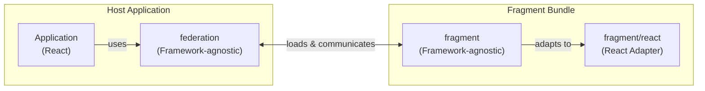

# Introduction

The Fragment system is a micro-frontend architecture that enables teams to develop, deploy, and maintain independent pieces of the application separately. Instead of building one monolithic frontend, the application is composed of multiple Fragments, each owned by different teams and deployed on their own schedules.

## What problems does it solve?

- **Independent deployments** - Teams can deploy their Fragments without coordinating with other teams or waiting for a full application release. This reduces deployment bottlenecks and enables faster iteration.
- **Team autonomy** - Each team owns their Fragment end-to-end, from development to production. Teams can make decisions about their codebase without affecting others.
- **Code isolation** - Fragments are isolated from each other, preventing unintended side effects. CSS styles, global state, and dependencies don't leak between Fragments.
- **Scalable development** - As the application grows, new features can be added as new Fragments without increasing the complexity of existing code.
- **Technology flexibility** - While the core is framework-agnostic, different Fragments could potentially use different versions of frameworks or even different frameworks entirely (with appropriate adapters).

## Architecture diagram

The following diagram shows how the packages relate to each other and how data flows through the system:

---

## Table of Contents

| Document | Description |
|----------|-------------|
| [Glossary](./glossary.md) | Key terms and definitions used throughout the Fragment system |
| [Principles](./principles.md) | Core design principles guiding the architecture |
| [Host Application](./host-application.md) | Application initialization flow |
| [Federation](./federation.md) | The orchestrator service: versioning, preloading, plugins, and component management |
| [Fragment](./fragment.md) | Fragment structure: build process, manifest format, methods, and components |

## Core packages

- `common` - Contains shared TypeScript types and interfaces used by both `federation` and `fragment` packages to ensure type safety across the system.
- `federation` - The main package installed in the root application. It provides all the functionality needed to load, manage, and communicate with Fragments, including APIs for registering components and methods.
- `fragment` - The package that each Fragment uses to interact with Federation. It provides APIs for accessing Federation services.
- `fragment/react` - A React-specific adapter for the `fragment` package. It converts framework-agnostic data into React primitives like props and hooks.
- `fragment/vite/react` - Vite plugin for building React fragments. Handles code splitting, manifest generation, dev server setup, and production builds.
- `fragment-tests/react` - Testing utilities for Fragments that include mocks for Federation interfaces and helpers for setting up test environments.
