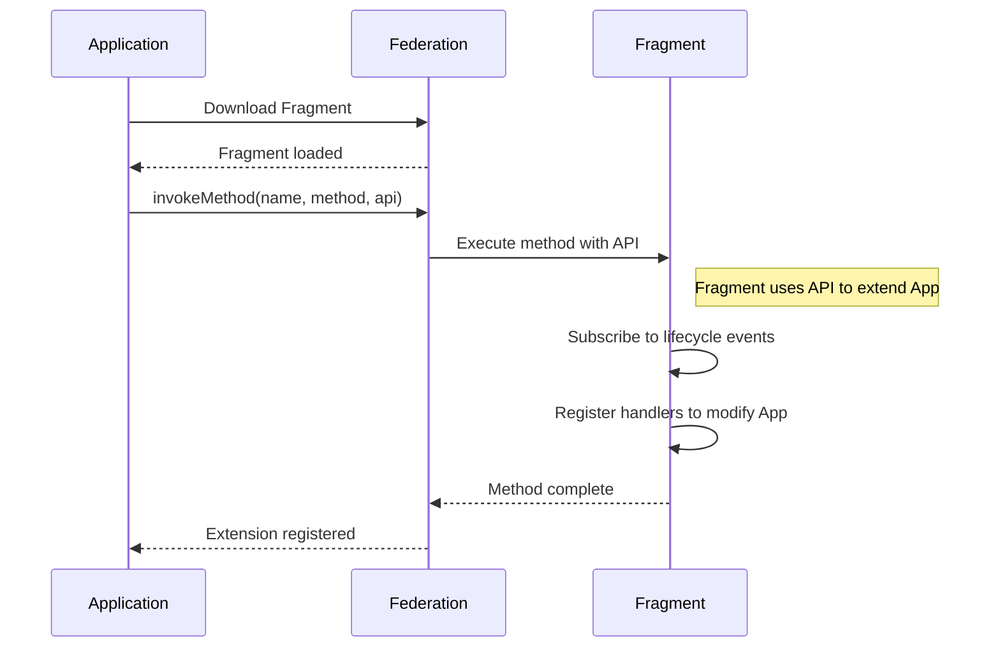

# Fragment

## Components

Components are UI elements exported by a Fragment with specific names. The Application can render these components by referencing their names.

Examples of how the Application can determine which component to render:
- **Hardcoded names** - The Application uses predefined component names that are known at build time.
- **Backend-driven names** - The Application requests the component name from the backend, allowing dynamic selection of which component to render.

Defining a component in Fragment:
```ts
import { defineFragmentComponent } from '@constructor/fragment';
import {
  fragmentVuePlugin,
  fragmentVueDefaultPresetPlugin,
  fragmentVueRouterPlugin,
  fragmentVueLocalizationPlugin,
} from '@constructor/fragment/vue';
import { createPinia } from 'pinia';
import { routes } from './learnerPublic.routes';
import PublicEntry from './LearnerPublic.vue';

// define fragment component with name "learnerPublic"
export default defineFragmentComponent('learnerPublic').plugins(
  // plugins are framework-specific and provides access to framework-agnostic Federation APIs
  fragmentVuePlugin(PublicEntry, {
    plugins: [createPinia()],
  }),
  fragmentVueRouterPlugin({ routes }),
  fragmentVueLocalizationPlugin(),
  fragmentVueDefaultPresetPlugin(),
);

```

## Methods

Methods are functions exported by a Fragment that can be invoked by the host application. They serve as "extensions" that allow Fragments to extend the Application's functionality. When a method is invoked, the Application passes an API object that the Fragment can use to subscribe to lifecycle events, modify application behavior, or register handlers.



Example (defining a method in Fragment):
```ts
export default defineFragmentMethod('methodName').callback(
  (federationApi, ...otherParamsFromInvoke) => {
    // method implementation
  },
);
```

## Plugins

Fragment plugins extend component and method functionality by hooking into lifecycle events. Plugins are framework-specific and provide access to framework-agnostic Federation APIs.

Example (React localization plugin):
```tsx
const FragmentLocalizationProvider: FC<PropsWithChildren> = ({ children }) => {
  /* ... */
}

export function fragmentReactLocalizationPlugin(): FragmentPlugin {
  return createFragmentPlugin('react-localization', (context) => {
    // hook into fragment lifecycle methods
    context.hook('react:created', (App) => {
      // wrap react app with localization provider, so components in app can use context methods
      return <FragmentLocalizationProvider><App /></FragmentLocalizationProvider>;
    });
  });
}
```

## Component mounting (Subfragments)

Fragments can mount other fragments (subfragments) using the same API that the host application uses. This enables composition of micro-frontends where one fragment can embed another fragment within itself.

```tsx
<FragmentRemoteComponent name="child-fragment-name" props={{ some: 'prop' }} />
```

> Note: The actual mounting is handled by Federation. `FragmentRemoteComponent` is a convenience wrapper that accesses the Federation API internally.

The unified API ensures consistency across the system - whether mounting from the host application or from within a fragment.

## Development

The Fragment system comes with a development server that provides features for efficient local development.

### Host App Proxy Mode

By default, the dev server runs in Host App Proxy mode, allowing you to develop your fragment within the real host application. The dev server:

1. Serves your current fragment locally with full HMR support
2. Proxies all other requests (including other fragments) to the target host application
3. Allows you to develop and test your fragment in the context of the real application

```bash
npm run dev
```

### Fragment Viewer

An app that displays statically collected information about the fragment: name, structure, packages, routes, description, dependencies, feature flags, etc. Useful for inspecting fragment metadata without running the full host application.


Fragment Viewer can also be built and deployed as a standalone static site for sharing fragment documentation with the team.

```bash
# Run locally
FRONT_FRAGMENT_VIEWER=1 npm run dev

# Build for deployment
FRONT_FRAGMENT_VIEWER=1 npm run build
```

### Remote Fragment Proxy

Configure other fragments to be served from different sources (local or remote) via environment variables. This is useful when developing a fragment that runs inside another fragment (subfragments).

```bash
# Proxy another fragment from another local fragment dev server you run
FRONT_FRAGMENT_OTHER_FRAGMENT_PROXY_URL=https://localhost:5174 npm run dev
```

### Localization Hot Reload

Translation files are served from source and trigger page reload on changes, enabling rapid iteration on localized content.

## Build process
Fragments are built using the `fragment()` Vite plugin. This plugin configures the Vite build process specifically for Fragment development and production builds. It handles code splitting, asset optimization, manifest generation, and sets up the development server for local Fragment development.

The build system produces stable chunks with content hashes, allowing multiple versions to coexist in one folder:

```
/fragments/my-fragment/
├── main.v1.0.0.js          → imports chunk-abc123.js, chunk-def456.js
├── main.v1.0.1.js          → imports chunk-abc123.js, chunk-xyz789.js
├── manifest.v1.0.0.json
├── manifest.v1.0.1.json
├── chunk-abc123.js         ← shared between versions (unchanged)
├── chunk-def456.js         ← only used by v1.0.0
└── chunk-xyz789.js         ← only used by v1.0.1
```

Users upgrading from v1.0.0 to v1.0.1 only download changed files (`main.v1.0.1.js`, `chunk-xyz789.js`), while `chunk-abc123.js` is served from cache.

## Bundle structure
When a Fragment is built, it produces the following output structure:

- `{entryName}.{version}.js` - The main entry point JavaScript file. A Fragment can have multiple entry points, each producing its own file.
- `assets/` - Directory containing static assets including images, additional JavaScript chunks, and CSS files.
- `assets/translations/` - Directory containing JSON translation files for each supported locale.
- `manifest.{version}.json` - A JSON file containing metadata about the Fragment that Federation uses for loading and configuration.

## Manifest
The manifest is a JSON file that describes the Fragment and its contents. Federation reads this manifest to understand what the Fragment provides and how to load it. The manifest includes information about entry points, components, methods, routes, translations, and feature flags.

Structure:

```ts
type FragmentManifest = {
  // Unique identifier for the Fragment, used by Federation to reference it
  name: string;
  // Version string, typically in format `{branch}.{hash}` for commit-based builds
  version: string;
  // Map of static assets and their dependencies, generated by Vite
  artifacts: ViteManifest;
  // Optional array of translation file configurations
  translations?: FragmentManifestTranslations;
  // Array of entry points that this Fragment exposes
  entries: FragmentManifestEntry[];
  // Array of feature flags that this Fragment uses
  featureFlags: FragmentManifestFeatureFlag[];
};

/**
 * Represents an entry point of the Fragment.
 * Each entry point can export multiple components and methods.
 */
type FragmentManifestEntry = {
  // Name of the entry, corresponds to the {entryName} part of the entry file
  name: string;
  // Components exported from this entry point
  components: FragmentManifestComponent[];
  // Methods exported from this entry point
  methods: FragmentManifestMethod[];
};

/**
 * Represents a component exported from an entry point.
 * Components can optionally define their own routing structure.
 */
type FragmentManifestComponent = {
  // Name of the component, used to reference it when mounting
  name: string;
  // Optional routing structure for this component
  routes?: FragmentRouteRecord[];
};

/**
 * Represents a method exported from an entry point.
 * Methods can be invoked by the host application or other Fragments.
 */
type FragmentManifestMethod = {
  // Name of the method, used to reference it when invoking
  name: string;
};

/**
 * Represents a route record for a component.
 * Defines the routing structure that the component handles.
 */
type FragmentRouteRecord = {
  // Route path, will be prefixed with Federation's `base` path when used in browser
  path: string;
  // Optional metadata for the route, can be used by Federation for layout decisions
  // Example: { layout: 'fullscreen' } to render the route without the standard page layout
  meta?: Record<string, boolean | string | number | undefined | null>;
  // Optional file path for dynamic import, used for preloading route-specific code
  file?: string;
  // Optional nested routes
  children?: FragmentRouteRecord[];
};

/**
 * Configuration for a translation file.
 * Tells Federation where to find translations for a specific locale.
 */
type FragmentManifestTranslations = {
  // Locale code, e.g., `en-US`, `de-DE`
  locale: string;
  // Path to the JSON file containing translations
  file: string;
  // Optional namespace to scope translations and avoid conflicts
  namespace?: string;
}[];
```
