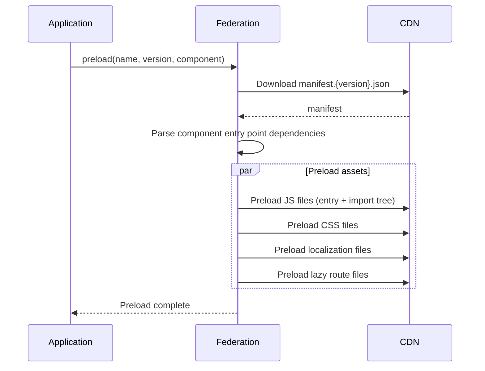

# Federation

## Responsibilities

Federation is responsible for the following core functions:

1. **Version management** - Tracking and setting which version of each Fragment should be loaded.
2. **Preloading** - Loading Fragment assets (JS, CSS, localization files) by name and version before they are needed, including assets for specific routes.
3. **Fragment service creation** - Instantiating Fragment services that provide access to components and methods exported by the Fragment.
4. **Component service** - Managing the lifecycle of Fragment components including mounting, unmounting, and passing properties to them.
5. **Method service** - Providing the ability to invoke methods exported by Fragments.
6. **Subfragment tree management** - Managing nested Fragments when one Fragment needs to instantiate and use another Fragment.
7. **Plugin API** - Allowing the host application to extend Federation's functionality and expose custom APIs to Fragments.

## Public API

### Creating federation instance in host application

```ts
const federationRoot = createFederation({
  plugins: [
    // ready plugins from package, for example integration with i18next
    createFederationI18nextPlugin(i18next),
    // ...or integration with tanstack router
    createFederationTanStackRouterPlugin({ router: tanStackRouter }),
    // plugins from application (in this case integration with logging system)
    createMyDataLakePlugin(),
    // ...other plugins
  ],
  // ...other config options
});

// setting versions
federationRoot.setVersions({ 'some-fragment-name': 'some-version' });

// preloading component, its locale files, manifest, ...
federationRoot.preload({ componentName: 'some-fragment-name' });

// methods added by plugins, in this case feature flags plugin
federationRoot.setFeatureFlags({ ... });

// ...and more: invokeMethod, createFragmentService, etc.
```

## Versioning
Federation maintains a registry of Fragment versions. When a Fragment is requested by name, Federation uses this registry to determine which version to load.

## Preloading
Federation can preload Fragment assets before they are actually needed. This includes JavaScript bundles, CSS files, dynamic route files, and localization files. Preloading is done by specifying the Fragment name and version, and Federation will fetch all necessary assets in the background.



## Component mounting
Federation handles the mounting and unmounting of Fragment components into the DOM. This includes injecting the Fragment's styles, applying style scoping to prevent CSS conflicts, and passing properties from the host application to the Fragment component.

```tsx
<FragmentRemoteComponent name="some-fragment-name" props={{ some: 'prop' }} />
```

> See [Fragment - Components](./fragment.md#components) for more information on defining components.

## Method invocation
Fragments can export methods that can be called by the host application. Federation provides an API to invoke these methods by specifying the Fragment name and method name.

```ts
// create a fragment
const fragment = federationRoot.createFragment({ name: fragmentName });

// load fragment's method
const method = await fragment.importMethod({ methodName });

// invoke it when needed
await method.invoke(/* args to be passed */);
```

> See [Fragment - Methods](./fragment.md#methods) for more information on defining methods.

## Subfragments
Federation provides an API that allows Fragments to instantiate and use other Fragments. This enables composition of micro-frontends where one Fragment can embed another Fragment within itself.

## Plugins

Plugins extend Federation's functionality and expose APIs to Fragments. The following plugins are available:

- **router** - Manages the base path for Fragment routes, provides custom route resolvers, synchronizes the Fragment's router with the host application's router, and exposes a routing API for Fragments to navigate and read route information.
- **feature flags** - Allows the host application to set feature flags that Fragments can read. Exposes an API for Fragments to check flag values.
- **localization** - Handles preloading of translation files, registers Fragment translation strings with the localization system, and exposes an API for Fragments to access translated strings.
- **color scheme** - Manages the application's color scheme (light/dark mode) and exposes an API for Fragments to read and react to scheme changes.
- **network** - Exposes a network request API that Fragments can use to make HTTP requests. This ensures consistent request handling across all Fragments.
- **logger** - Exposes a logging API that Fragments can use for consistent logging across the application.
- **root data** - Exposes data from the root application to Fragments, such as current user information, permissions, and other application-level data.
- **root handlers** - Exposes functions from the root application that Fragments can call, enabling Fragments to trigger actions in the host application.
- **root storage** - Exposes a persistent storage API to Fragments. Data stored through this API persists even after the Fragment is unloaded, allowing Fragments to maintain state across sessions.

### Plugin example
```ts
// defining a federation plugin
export default createFederationPlugin('dataLake', (context) => {
  // add hooks to extend the system. in this example we hook into component creation process
  context.hook('component:create', onComponentCreate);

  function onComponentCreate(component: InternalFragmentComponentService) {
    // add "dataLake" to component context, so component can access "dataLake" api
    component.context.dataLake = {
      // component can call "logEvent" function
      logEvent(eventOptions: DataLakeEventRecord) {
        // logic to set event to data lake
      },
    };
  }
});
```
