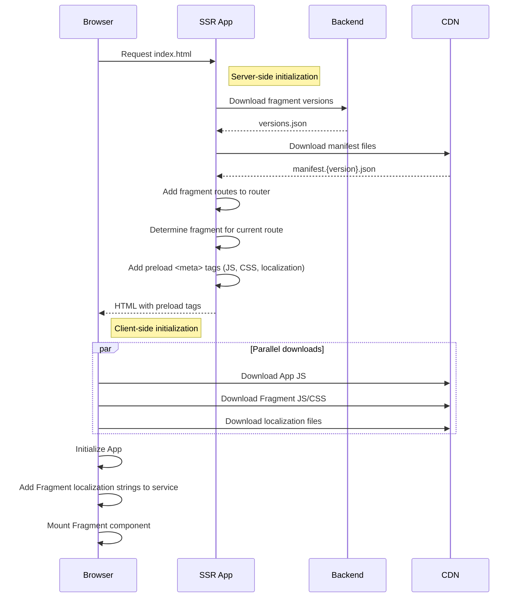

# Host Application

## Application initialization flow

The following diagram shows the sequence of events when a user requests a page that uses Fragments:

```mermaid
sequenceDiagram
    participant Browser
    participant SSR as SSR App
    participant Backend
    participant CDN

    Browser->>SSR: Request index.html

    note right of SSR: Server-side initialization
    SSR->>Backend: Download fragment versions
    Backend-->>SSR: versions.json
    SSR->>CDN: Download manifest files
    CDN-->>SSR: manifest.{version}.json
    SSR->>SSR: Add fragment routes to router
    SSR->>SSR: Determine fragment for current route
    SSR->>SSR: Add preload <meta> tags (JS, CSS, localization)

    SSR-->>Browser: HTML with preload tags

    note right of Browser: Client-side initialization
    par Parallel downloads
        Browser->>CDN: Download App JS
        Browser->>CDN: Download Fragment JS/CSS
        Browser->>CDN: Download localization files
    end
    Browser->>Browser: Initialize App
    Browser->>Browser: Add Fragment localization strings to service
    Browser->>Browser: Mount Fragment component
```
